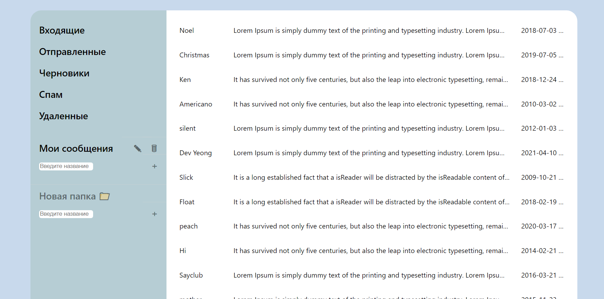

# **Mailbox** 📧 [demo](https://mail-box-lilac.vercel.app)

## Mailbox with TypeScript, Redux, and NextJS

---

## Description:

### An email client that allows view emails and move them between folders.

- Letters are divided into folders (as in regular mail):
  "Inbox / Sent / Drafts / Deleted / Spam"l;
- It is possible to go into the folder and see the list of messages contained in it;
- Implemented creation, viewing, editing and deleting folders for letters, moving letters to them;
- Implemented the ability to move selected emails to
  another folder.
- Implemented the ability to open a full letter for viewing (display the Author, the date of sending, the full text of the letter);

## Deploy on Vercel
